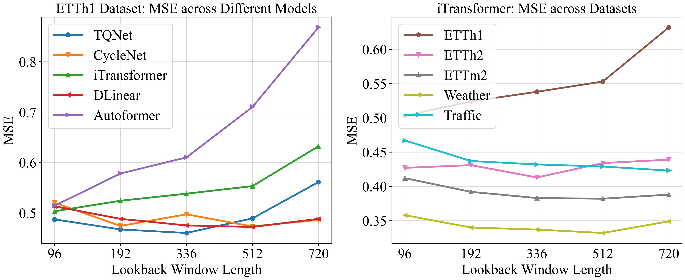
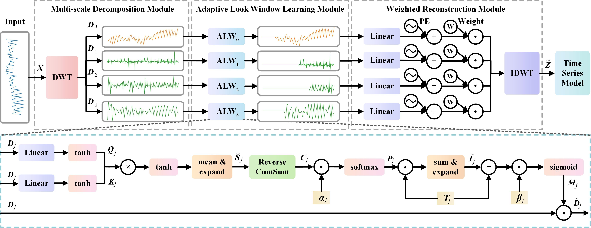
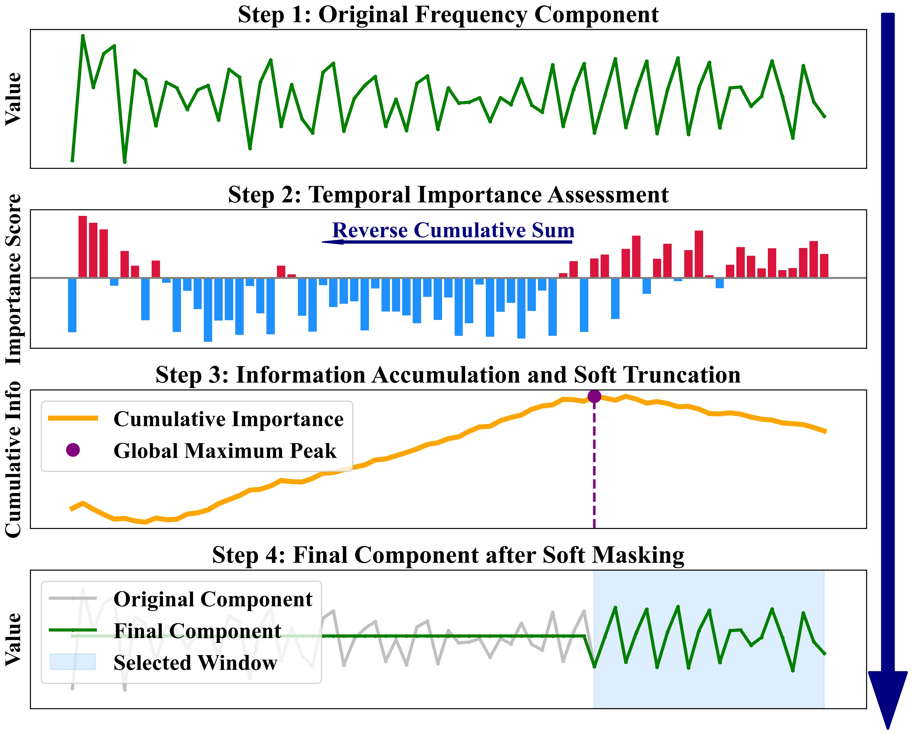

# ALW

This repo is the implementation for the paper: Efficiently Enhancing Long-term Series Forecasting via Adaptive Lookback with Wavelets.

## Introduction
This paper addresses the critical challenge of long-term series forecasting, where conventional models relying on fixed-length lookback windows often struggle with the inherent dynamic dependencies and multi-scale characteristics of the data. As illustrated in the figure below, the optimal lookback window length indeed varies significantly across different models and datasets, highlighting the inherent limitations of such fixed-window strategies. We propose the **Adaptive Lookback Window (ALW)** framework, a wavelet transform-driven approach that dynamically determines optimal lookback window lengths by leveraging multi-scale characteristics and adaptive attention mechanisms. ALW, as an efficient plug-and-play technique, not only reduces the MSE of backbone models but also reduces hyperparameter tuning requirements and enables input feature dimensionality reduction, which reduces subsequent model computational costs.



## Overall Architecture
ALW employs a three-module design: **Multi-scale Decomposition Module**, **Adaptive Lookback Window Learning Module**, and **Weighted Reconstruction Module**. The Multi-scale Decomposition Module utilizes wavelet transforms to decompose time series into distinct frequency components. The Adaptive Lookback Window Learning Module quantifies the contribution of each historical time step via scale-specific attention mechanisms and dynamically determines optimal window lengths through information reverse accumulation and soft truncation techniques. Finally, the Weighted Reconstruction Module generates refined input features for downstream prediction models via a weighted reconstruction process. This design enables ALW to adaptively select and utilize the most relevant historical information at multiple scales.



The core of this architecture is the **Adaptive Lookback Window Learning Module**, which operates in a differentiable, three-stage process. First, scale-specific attention computes channel-aggregated temporal importance scores, highlighting predictive historical patterns. Next, reverse information accumulation and a soft boundary learning mechanism (via Soft-argmax) derive continuous cutoff indices based on where information contribution saturates. Finally, a sigmoid-based soft mask smoothly truncates irrelevant history while preserving end-to-end trainability. This entire mechanism allows the model to adaptively retain only the most informative context for forecasting, as visualized in detail below.



## Getting Started

### Environment Requirements

To get started, ensure you have Conda installed on your system and follow these steps to set up the environment:

```
conda create -n ALW python=3.8.8
conda activate ALW
pip install -r requirements.txt
```

### Data Preparation

You can obtain all the benchmarks from [Google Drive](https://drive.google.com/drive/folders/1ZOYpTUa82_jCcxIdTmyr0LXQfvaM9vIy) provided in Autoformer. All the datasets are well pre-processed and can be used easily.

```
mkdir dataset
```
**Please put them in the `./dataset` directory**

### Training Example
- In `scripts/ `, we provide the model implementation *Autoformer+ALW/DLinear+ALW/iTransformer+ALW*
- In `TQNet_CycleNet/scripts/`, we provide the *CycleNet+ALW/TQNet+ALW* implementation

For example:

To train the **iTransformer+ALW** on **Weather dataset**, you can use the script `scripts/Weather/iTransformer_ALW.sh`:
```
sh scripts/Weather/iTransformer_ALW.sh
```
**Note on Hyperparameters: While we provide the best hyperparameter settings obtained on our equipment, optimal settings for lighter datasets like ETT or Exchange might differ across various devices. You can perform hyperparameter searches using the commented-out code blocks in our provided best settings to achieve optimal performance on your setup.**

## Citation

If you find this repo useful, please cite our paper.

```
@inproceedings{tong2026efficiently,
  title={Efficiently Enhancing Long-term Series Forecasting via Adaptive Lookback with Wavelets},
  author={Tong, Suxin and Yuan, Jingling},
  booktitle={Proceedings of the AAAI Conference on Artificial Intelligence},
  volume={40},
  number={31},
  pages={25966-25974},
  year={2026}
}
```

## Acknowledgement

We extend our heartfelt appreciation to the following GitHub repositories for providing valuable code bases and datasets:

https://github.com/thuml/Time-Series-Library

https://github.com/ACAT-SCUT/TQNet

https://github.com/ACAT-SCUT/CycleNet

https://github.com/thuml/iTransformer

https://github.com/cure-lab/LTSF-Linear

https://github.com/thuml/Autoformer

